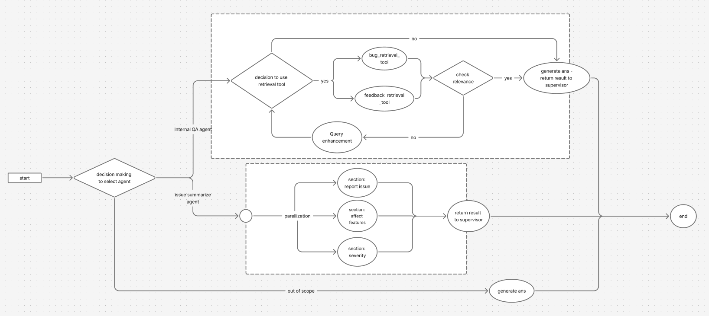
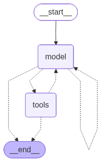
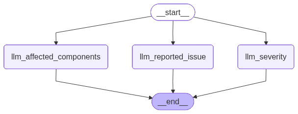

# Supervisor AI Assistant

LangGraph-based multi-agent assistant that routes user queries between retrieval QA and structured summarization workflows.



## System Overview

- **Supervisor router**: Central controller that inspects each user query and chooses the best specialist. See `agents/supervisor/graph.py:1` for the LangChain agent wiring and `agents/supervisor/tools.py:6` for the tool wrappers that expose the sub-agents.
- **Internal QA agent**: Retrieval-augmented workflow that searches bug reports and user feedback before crafting a grounded answer. The LangGraph topology lives in `agents/internal_qa/graph.py:1`.
- **Issue summary agent**: Structured extraction pipeline that converts a raw incident report into `reported_issue`, `affected_components`, and `severity`. The graph is defined in `agents/issue_summary/graph.py:1`.

## Agent Concepts

### Supervisor Router

- Uses `create_agent` with the `SUPERVISOR_SYSTEM_PROMPT` to reason about each request and select between tools or respond directly (`agents/supervisor/graph.py:1`).
- Stores routing metadata (`selected_agent`, `reason_selection`, `final_answer`) in a structured state, enabling downstream logs or UI display (`agents/supervisor/state.py:1`).
- Exposed to external callers as `ai_assistant.invoke(...)`, which is what the FastAPI service wraps.

### Internal QA Graph Agent

- LangGraph state machine that alternates between tool calls and reflection to ensure relevant context (`agents/internal_qa/graph.py:1`).
- Selects between bug-report or user-feedback retrievers via a routing LLM (`agents/internal_qa/node.py:17` and `agents/internal_qa/tools/retriever.py:33`).
- Grades retrieved chunks and rewrites questions when the context is weak, helping the assistant recover from poor retrievals (`agents/internal_qa/node.py:36`).

### Issue Summary Graph Agent

- Parallel LangGraph branches derive the three structured fields from the same incident text (`agents/issue_summary/graph.py:5`).
- Each node uses a dedicated system prompt and structured output schema to keep responses consistent (`agents/issue_summary/node.py:18` and `agents/issue_summary/state.py:6`).
- Severity decisions follow the rubric encoded in `agents/issue_summary/prompt.py:28`, ensuring predictable triage labels.

## Data & Retrieval Layer
- Vector stores are persisted under `vectorstore/chroma_db/` and built from seed corpora in `vectorstore/data/`.
- `vectorstore/setting.py:29` rebuilds collections for bug reports and user feedback. The script clears any stale embeddings before loading new documents, so you get deterministic runs.
- OpenAI API access is required for embeddings and LLM calls. Keep your keys in `.env` (never commit secrets).

## Application Surfaces
- **FastAPI service** (`apps/api.py`) exposes a REST endpoint that forwards `query` payloads to `ai_assistant.invoke(...)`, then returns the router’s structured response.
- **Streamlit UI** (`apps/streamlitUI.py`) provides a lightweight chat interface where testers can supply an `OPENAI_API_KEY`, send messages, and inspect agent choices.

## Getting Started
**This demo uses the OpenAI model for implementation. To test it, you must have a valid OpenAI API key.**

### Prerequisites
- Python 3.12+
- [uv](https://github.com/astral-sh/uv) package manager
- OpenAI API key (and optional LangSmith credentials for tracing)

### Environment Setup
1. Install dependencies:
   ```bash
   uv sync
   ```
2. Create `.env` and add the required keys:
   ```env
   OPENAI_API_KEY=sk-...
   LANGCHAIN_TRACING_V2=true
   LANGCHAIN_ENDPOINT=https://api.smith.langchain.com
   LANGCHAIN_API_KEY=lsv2-...
   LANGCHAIN_PROJECT=your-project-name
   ```

### Initialize the Vector Stores
Run once locally and every time a new Docker container starts:
```bash
uv run vectorstore/setting.py
```
This rebuilds the `bug_reports` and `user_feedback` collections so retrieval tools have fresh embeddings.

### Run the Services
- Start the FastAPI backend:
  ```bash
  uv run uvicorn apps.api:app --reload
  ```
- Launch the Streamlit UI:
  ```bash
  uv run streamlit run apps/streamlitUI.py
  ```
  The page prompts for an API key if one is not already present in the environment.

## Docker Usage
1. Populate the `.env` located next to `docker-compose.yaml`:
   ```env
   OPENAI_API_KEY=sk-...
   LANGCHAIN_TRACING_V2=false
   LANGCHAIN_ENDPOINT=
   LANGCHAIN_API_KEY=
   LANGCHAIN_PROJECT=
   ```
2. Build and launch every service:
   ```bash
   docker compose up --build
   ```
3. Exercise the stack.
   - Streamlit UI → http://localhost:8501  
     ```bash
     What are the issues reported on email notification?
     ```
     ```bash
     Users cannot log in via Google OAuth since 8 AM UTC. The login button shows a 500 internal server error. This impacts all new sign-ins.
     ```
     ```bash
     หลังการปล่อยอัปเดตเมื่อวาน หน้าแดชบอร์ดวิเคราะห์ข้อมูลโหลดช้ามาก จากเดิม 2 วินาทีเป็นเกือบ 10 วินาที โดยเฉพาะบนมือถือมักเกิด timeout
     ```
     ```bash
     What did users say about the search bar?
     ```
     ```bash
     hi
     ```
   - FastAPI endpoint → http://localhost:8000  
     ```bash
     curl -X POST "http://127.0.0.1:8000/query" \
       -H "Content-Type: application/json" \
       -d '{
         "query": "What did users say about the search bar?"
       }' | jq
     ```
     ```bash
     curl -X POST "http://127.0.0.1:8000/query" \
       -H "Content-Type: application/json" \
       -d '{
         "query": "hi"
       }' | jq
     ```
     ```bash
     curl -X POST "http://127.0.0.1:8000/query" \
       -H "Content-Type: application/json" \
       -d '{
         "query": "Users cannot log in via Google OAuth since 8 AM UTC. The login button shows a 500 internal server error. This impacts all new sign-ins."
       }' | jq
     ```
     ```bash
     curl -X POST "http://127.0.0.1:8000/query" \
       -H "Content-Type: application/json" \
       -d '{
         "query": "What are the issues reported on email notification?"
       }' | jq
     ```

## 🎥 Demo

Watch the AI Assistant in action:

<video src="https://github.com/chanathip-tor/chatbot/blob/main/demo-ai-assistant.mov?raw=true" controls width="720"></video>

Alternatively, you can click the thumbnail below:

[](https://github.com/chanathip-tor/chatbot/blob/main/demo-ai-assistant.mov?raw=true)
